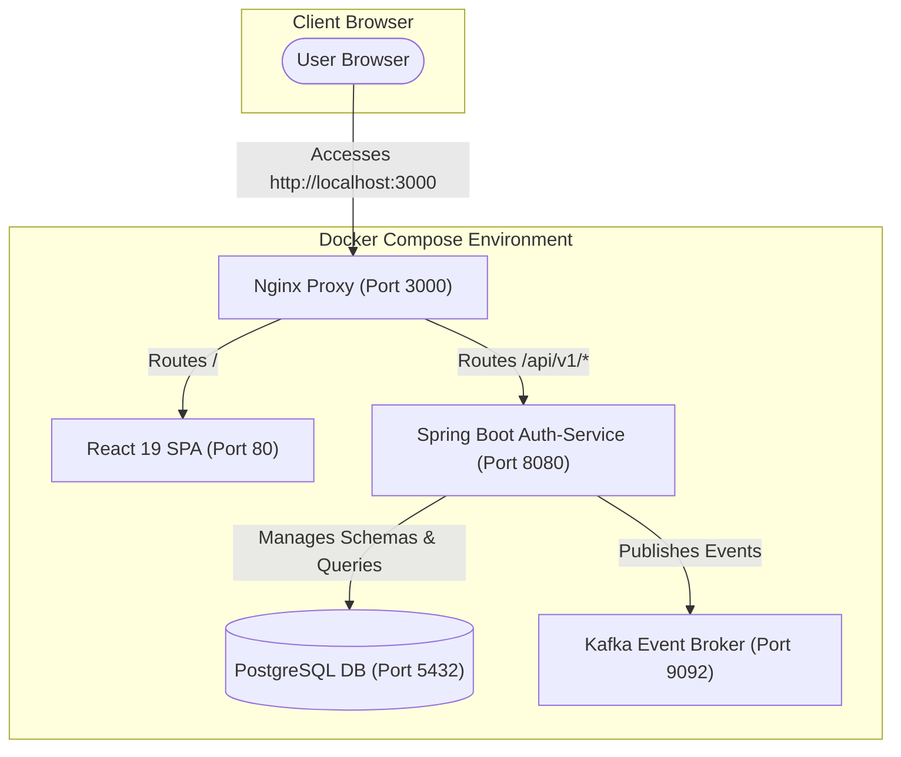
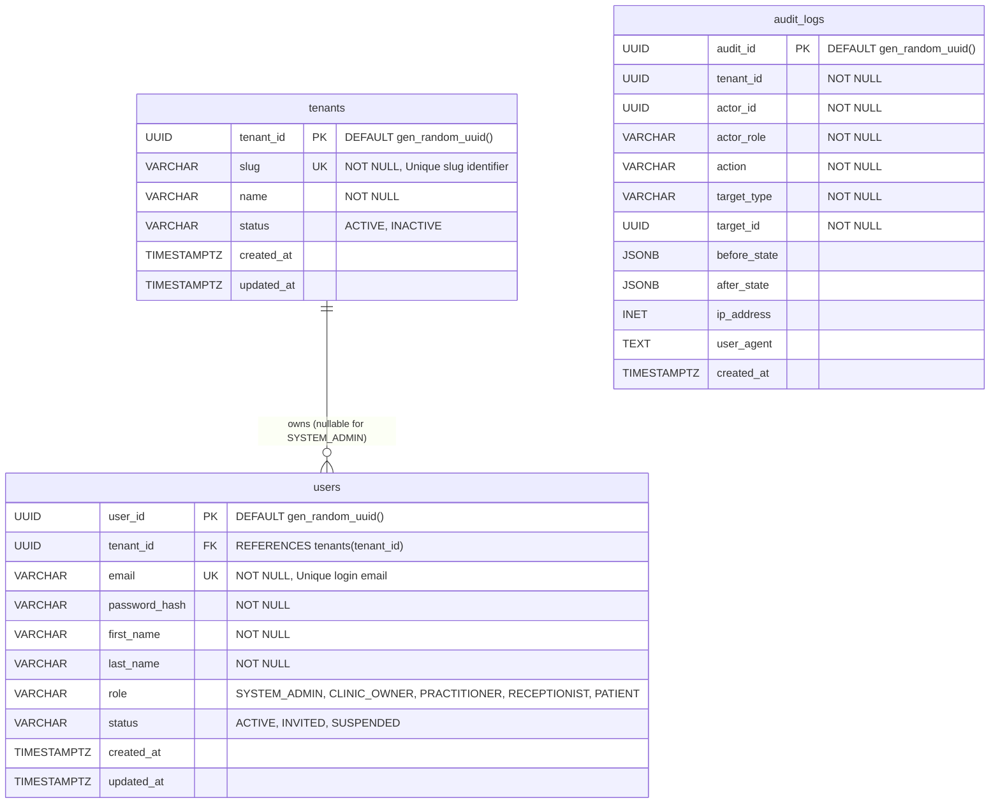
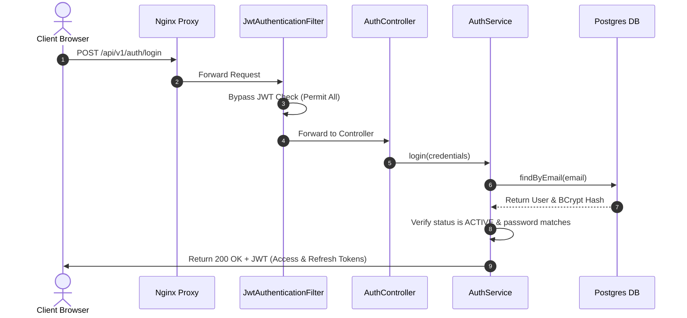
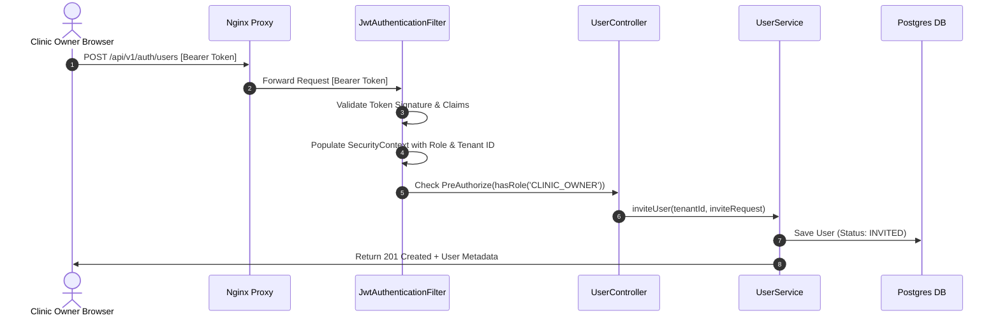

# Pracisos Platform - Phase 1 MVP Architecture

This document outlines the architecture, components, database schema, and authentication flows of the **Pracisos Practice Management Platform** built so far.

---

## 1. System Topology
The platform uses an isolated multi-tenant architecture. All services are containerized and communicate over an internal Docker network, with Nginx acting as a reverse proxy for the frontend assets and backend API.

---

## 2. Component Design

### Backend (Spring Boot 3.3 + Java 21)
* **Security & Auth:** Configured in `SecurityConfig` and `JwtAuthenticationFilter`. Uses JWT stateless sessions, whitelisting `/login` and `/refresh`, and protecting tenant-registration (`/register`) to `SYSTEM_ADMIN` and staff invitations (`/users`) to `CLINIC_OWNER`.
* **Tenant Service:** Validates, saves new tenant clinic spaces, and publishes `TenantCreatedEvent`.
* **User Service:** Generates temporary passwords, hashes passwords via BCrypt, registers user roles (`SYSTEM_ADMIN`, `CLINIC_OWNER`, `PRACTITIONER`, `RECEPTIONIST`, `PATIENT`), and publishes `UserCreatedEvent`.

### Frontend (React 19 + TypeScript + Redux Toolkit)
* **API Service:** Leverages RTK Query `authApi` to communicate with backend endpoints `/auth/login`, `/auth/register`, `/auth/users`, and `/auth/tenants/{slug}`.
* **Routing:** Managed via `React Router v6` in `router.tsx` to redirect users based on roles (e.g., `SYSTEM_ADMIN` -> `/admin/dashboard`, clinic staff -> `/:tenantSlug/dashboard`).
* **Design Aesthetic:** Tailored vanilla CSS rules matching a clean, light, teal-accented clinic dashboard layout.

---

## 3. Database Entity Relationship (ER) Schema
The relational database runs on Postgres 16 and utilizes Flyway migrations (`V1__init.sql` and `V2__seed_admin.sql`) to establish constraints, default values, and indexes.

> [!IMPORTANT]
> **Check Constraint (`chk_tenant_admin`):**
> Enforces data consistency by verifying that:
> * `SYSTEM_ADMIN` accounts have no tenant mapping (`tenant_id IS NULL`).
> * Clinic-specific accounts (`CLINIC_OWNER`, `PRACTITIONER`, `RECEPTIONIST`, `PATIENT`) must belong to a tenant (`tenant_id IS NOT NULL`).

---

## 4. Authentication Sequence Flows

### User Login Flow
This sequence shows the path for a standard user logging in.

### Protected Request Flow (e.g. Invite Staff)
This sequence shows the authentication check for protected resources (like a Clinic Owner inviting a Practitioner).

